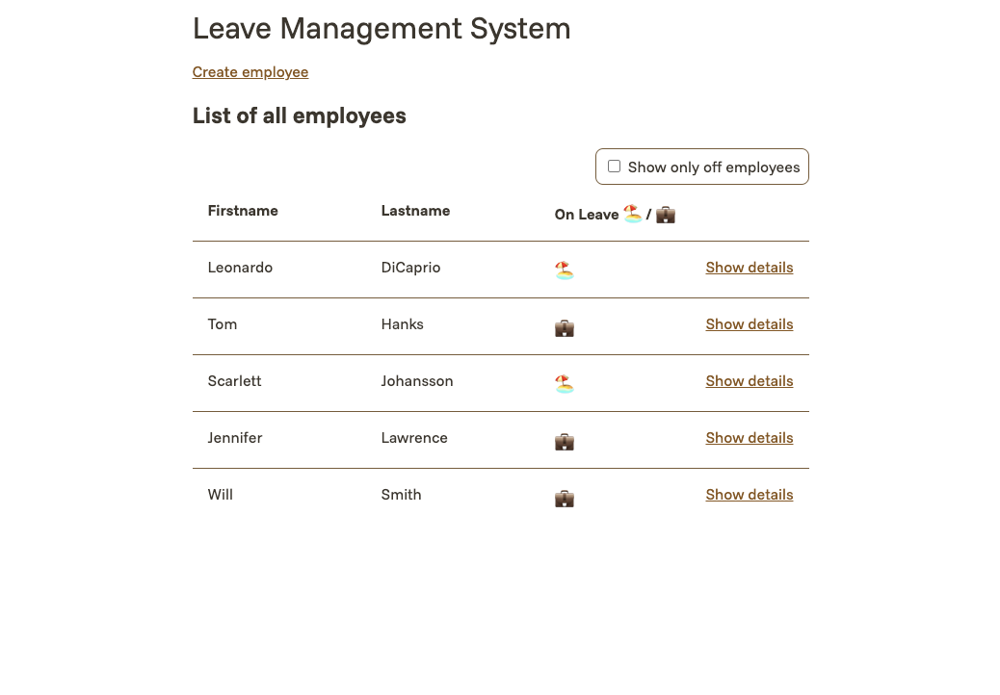

# Challenge3



## Getting Started

First, you need to start the containers:

```sh
docker compose up -d
```

Then, run the migrations:

```sh
docker compose exec backend node --experimental-strip-types src/migrate.ts
```

The app is now live at http://localhost/.

To change the app's port, modify the LIXOTECH_PORT environment variable in the .env file.

## Better Development Experience

For a better development experience, you need to run four commands in four terminals.

Start a PostgreSQL server:

```sh
docker run -it --rm -p 5432:5432 -e POSTGRES_PASSWORD=postgres postgres
```

Start watching changes in the backend:

```sh
(cd backend && npm run dev)
```

Start watching changes in the frontend:

```sh
(cd frontend && npm run dev)
```

Start a Caddy reverse proxy to unify the backend and the frontend:

```sh
caddy run --adapter caddyfile --config reverse_proxy/dev.Caddyfile
```

You can start developing at http://localhost/.

Ensure that the database migrations have been run for the app to work properly:

```sh
(cd backend && node --experimental-strip-types src/migrate.ts)
```
